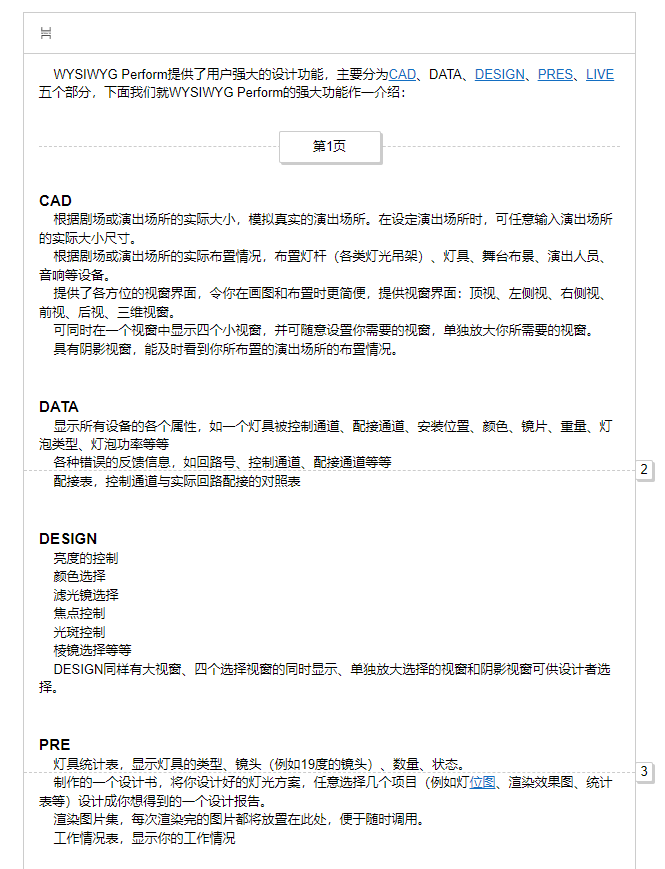

# Quill Pagination
> A CKEditor-like style component

Applicable version: Quill v1.3.7



# Usage
```js
import 'quill-pagination';
import 'quill-pagination/lib/style.css';

new Quill('#container', {
    theme: 'snow',
    modules: {
        toolbar: ['pagination'],
        pagination: {
            userText: "第{page}页", // {page} is replaced with the number of pages
            autoText: '{page}',
            pageHeight: '140mm' // page height of the wrapped line
        }
    }
})

```